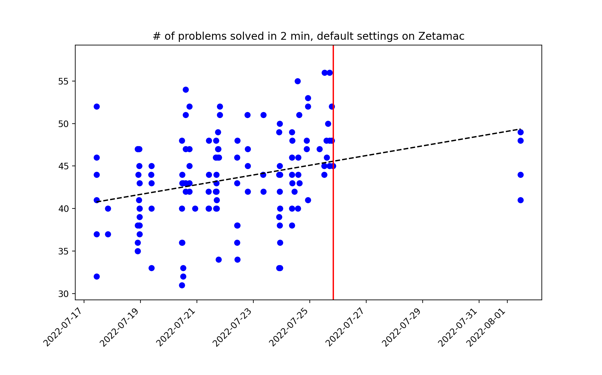
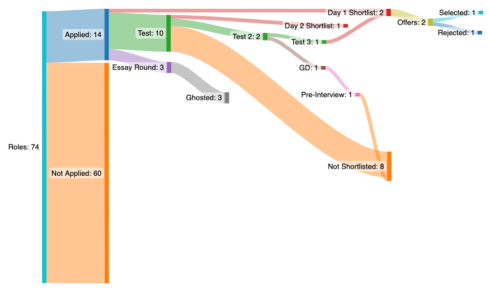

# quant-prep

Inspired by [Jerry Qin](https://jerryqin.com), I decided to log my quant preparation as well. I've been going about it in an unstructured, indisciplined way so far, but have made progress (at the expense of other things), and thought that keeping a log of what I've accomplished should be helpful

## The Targets

Deciding on your targets helps you with prep: some companies have different styles/rounds of interviewing, and there's no one size fits all. With that said, here are a 

1. **Jane Street**: The big daddy. Four to Five rounds of interviews from what I've heard, along with one (maybe two?) subjective online tests. Depth of thought is important, along with (as very aptly phrased on quora) _an intuitive understanding of expectation and variance of hard to estimate quantities_. Unsaid IMO prerequisite?
2. **Optiver**: Human calculators go here. There's a 80 question, 8 minute mental math test, followed by a sequences test and then a subjective probability test. The mental math test weeds out almost all the candidates from what I've heard, and following the online tests, there's a market making group discussion, followed by more interviews, which are just as gruelling as Jane Street
3. **QuantBox SG**: Quant Shop made by ex-Graviton, very recent, so don't know much about them. Interview process will most probably just be puzzles and stuff (I should contact seniors about this)
4. **Tower**: Very systems heavy, traders need to have deep systems knowledge. It's a nice place to work but are very picky choosy with who they shortlist and what they do with them.

There are others as well (Quadeye, Graviton, NK, APT), a few of which I applied to, but I wanted to go for an offshore role, considering how almost everyone in my year went abroad for a research intern this summer.

## Books

1. **Xinfeng Zhou** - Blah Blah Blah Quant Finance Interviews. Amazing book. Especially the brainteasers and Probability section. Must do
2. **50 problems in Probability** - Didn't like this much: mix of brain teaser + probability, plus the questions felt very _loosely worded_ to me, as in their key element was their ambiguity in some cases, and not the mathematical prowess needed to solve them.
3. **Mark Joshi** - Too broad to be very useful
4. **[Jane Street's Probability and Markets Guide](https://www.janestreet.com/probability-markets/)** - read this for market making

Books others have recommended but I didn't read:
1. **Heard on the street** - sounded like Cracking the Coding Interview but for quant, and I _detest_ that book.

## Mental Math

1. [Zetamac](https://arithmetic.zetamac.com) - baseline of 50, peak of 60 on default settings
2. [RankYourBrain](https://rankyourbrain.com/mental-math/) - has fractions/decimals, but I don't like the UI
3. [RFQJobs](https://rfqjobs.com/practice/math/) - Really liked the Optiver test here and the Focus-Fractions and Focus-Decimals
4. [tradinginterview](https://www.tradinginterview.com/courses/mental-arithmetic/quizzes/quiz-hard-arithmetic/) Hard - This is probably the closest to the optiver test from what I can make out: sequential flow, +/-1 marking, and questions of the same format and same level
5. [TraderMaths](https://www.tradermaths.com/math-tests) hard - decent, but again, UI is off what I should expect (ability to skim through questions makes it very easy to cherry pick easy ones to maximize score), so I don't do this much

## More Puzzles/Problems

1. **[Brainstellar](https://brainstellar.com)** - good puzzles, but the hard ones are not so hard, and they finish up rather quickly. 
2. **[Jane Street's Puzzles](https://www.janestreet.com/puzzles/archive/index.html)** - If anything, these are a level above what I think will be asked on the interview. Absolutely a pleasure to sink your teeth into: need both deep insight and flexible thinking to solve. Some of the relevant ones are
    * [Robot Tug-of-war](https://www.janestreet.com/puzzles/robot-tug-of-war-index/)
    * [Andy's Morning Stroll](https://www.janestreet.com/puzzles/current-puzzle/)
    * [Bracketology 101](https://www.janestreet.com/puzzles/bracketology-101-index/)
    * [Circle Time](https://www.janestreet.com/puzzles/circle-time-index/)
    * [Alter/Nate](https://www.janestreet.com/puzzles/alter-nate-index/)
    * [Candy Collectors](https://www.janestreet.com/puzzles/candy-collectors-index/)
    * [Single Cross](https://www.janestreet.com/puzzles/single-cross-index/)
3. [Twenty Probability Problems](https://www.math.ucdavis.edu/~gravner/MAT135A/resources/chpr.pdf)
4. [Evan Chen's Probability Handout](https://web.evanchen.cc/handouts/ProbabilisticMethod/ProbabilisticMethod.pdf)
5. [AoPS Intermediate Probability Problems](https://artofproblemsolving.com/wiki/index.php/Category:Intermediate_Probability_Problems) - Mostly from AIME/Other olympiads
6. [Putnam Probability questions](http://www.math.utoronto.ca/barbeau/putnamprob.pdf) - ft. the [Infamous 1992 A-6 Problem](https://www.youtube.com/watch?v=OkmNXy7er84&ab_channel=3Blue1Brown)
7. [Jerry Qin's List of Probability Questions](https://jerryqin.com/) - as previously mentioned
8. [Sums and Expcted Value](https://codeforces.com/blog/entry/62690) by Errichto: has some nice problems
9. The random Wall Street Oasis/QuantNet threads on these questions - [here](https://quantnet.com/threads/big-list-of-quant-interview-questions-with-answers.36240/), [here](https://quantnet.com/threads/jane-street-interview-questions.3039/), [here](https://quantnet.com/threads/jane-street-capital-second-round-interview.12565/), [here](https://quantnet.com/threads/compilation-of-jane-street-interview-questions.17941/), [here](https://quantnet.com/threads/jane-street-interview-question-needing-help.7591/), [here](https://www.glassdoor.co.in/Interview/Jane-Street-Hong-Kong-Interview-Questions-EI_IE255549.0,11_IL.12,21_IC2308631.htm) - One Glassdoor reviewer said that you should _Forget about the green book - only do dice and card problems and scrape the whole glassdoor_ for Jane Street.
10. Some questions [here](http://williamdemeo.github.io/2014/03/19/probability-quiz/) and [here](https://github.com/ptmminh/quanttest) (very similar questions in both though, doing one thoroughly should be sufficient)
11. [Quant Interview Prep](https://www.math.lsu.edu/~smolinsk/Quant_Interview_Prep.pdf) handout by Aaron Cao
12. [Glassdoor Quant Compilation](https://www.glassdoor.co.in/Interview/quant-interview-questions-SRCH_KO0,5_IP2.htm) (got this from the handout above - very handy)

## Other things

A (non-exhaustive) list of very common problems to be familiar with:
* Monty Hall
* Tying ends of Noodles together, expected value
* Random Walks
* finding Expected first return time in Markov Chain (esp when No stationary distrib exists)
* Prisoner number in drawer ([Veritasium](https://www.youtube.com/watch?v=iSNsgj1OCLA&ab_channel=Veritasium))
* Prisoners, Hats and umpteen variations
* Birthday Problems
* Three Drawer Paradox (and variations - tie, two envelope, etc)

That's about it, I guess.

## Hindsight

Might probably publish a blog post on this, along with some learnings in the whole process.

**TL;DR**: I'll be an SWE intern at Optiver this summer! :)

